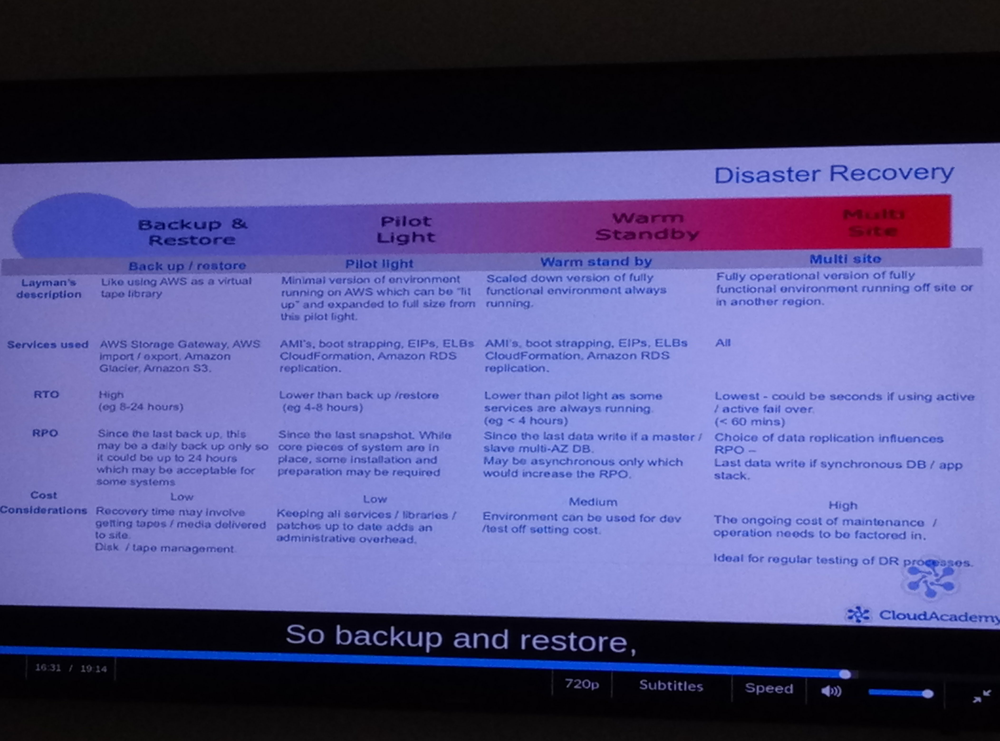

# Designing Highly Available, Cost Efficient, Fault Tolerant, Scalable Systems for Solutions Architect Associate on AWS

[Cloudacademy Course](https://cloudacademy.com/amazon-web-services/designing-highly-available-cost-efficient-fault-tolerant-scalable-systems-course/)

## Elasticity and Scalability
* Repeated content

## Designing for Disaster Recovery / Business Continuity

### Concepts
* RTO: Recovery Time Objective. Ex. 8 hs
* RPO. Recovery Point Objective. Ex. 1 hour (data loss allowed)

### Scenarios

1. Backup & Restore
* Direct Connect
* Aws Storage Gateway
* Aws Import/Export
* Considerations
  * Retention time for media
  * Security of archives
  * Requires regular testing

2. Pilot Light
* Data is mirroring
* Aws is not running
* When disaster occurs change to Aws
* Scale Horizontal
  
3. Warm Standby
* Run minimum at Aws
* Scale Up
* Idem to Pilot Light
  * Replicate data
  * Maintain AMIs
  * Update Software
  * Update configuration files

4. Multi Site
* Duplicate Capacity environment to Aws
* Preferred One, expensive one
  
### Testing Recovered Data

1. Backup & Restore
* Freeze data changes to the DR site
* Take a backup
* Restore the backup to the primary site
* Re-point users to the primary site
* UNfreeze the changes

2. Pilot Light, Warm Standby and Multi Site
* Establish reverse mirroring7replication from the DR site back to the primary site, once the y site has caught up with the changes
* Freeze data changes to the DR site
* Re-point users to the primary site
* UNfreeze the changes

### Replication Considerations
* Distance between the sites. Latency and Jitter
* Available bandwidth. Breath and variability
* Data rate required for the application
* Replication technology (parallel?)

### Replication. The Basics
* Synchronous --> direct to both (Atomic)
* Asynchronous --> one db --> second db (Non atomic)

### Data Recovery Services
* Aws Import/Export (Snowball) Physical device
  *  S3 Bucket, Glacier Vault or ESB Snapshot
* Aws Storage Gateway
  - Gateway-cached volumes
    * Data to S3, retain frequent data locally
	* Cost saving on primary storage
  - Gateway-stored volumes
    * low latency to the entire data set
	* save primary data locally and asynchronous backup point-in-time snapshot to S3
  - inexpensive offside backups
* Gateway-VTL (Virtual tape library)

### Disaster Recovery Summary

