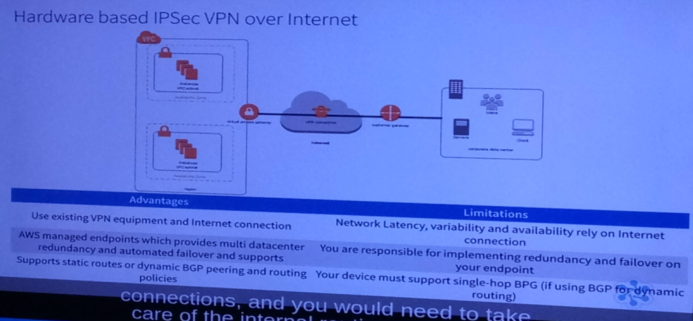
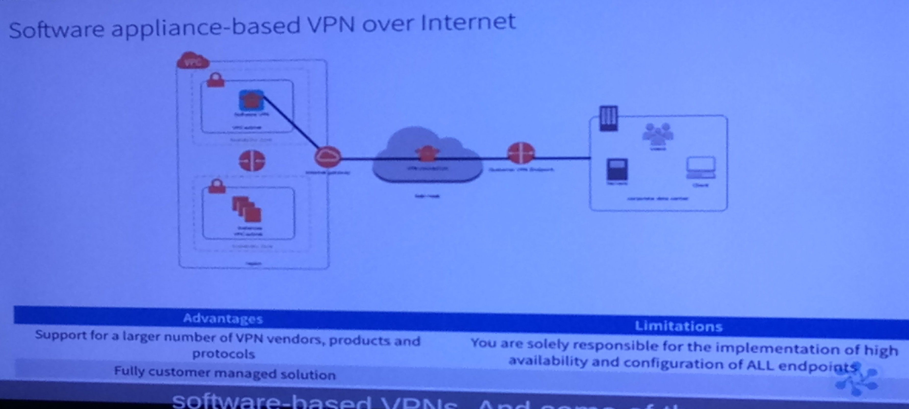
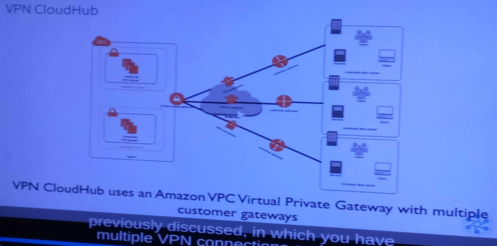
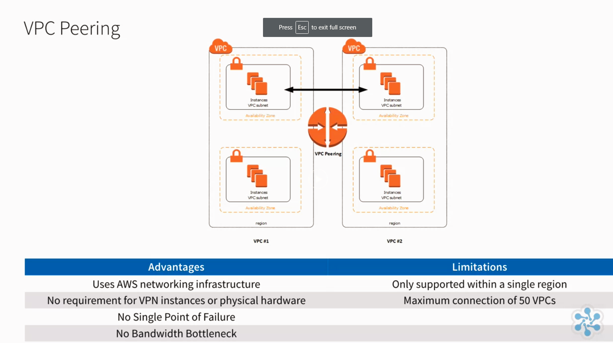
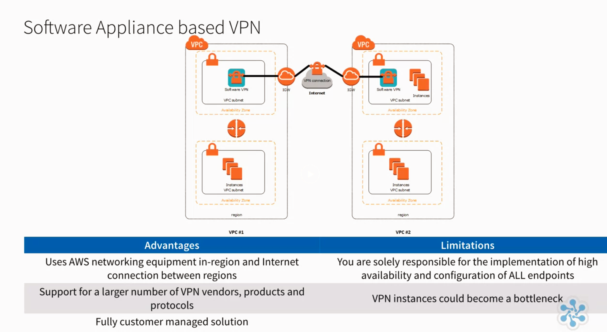
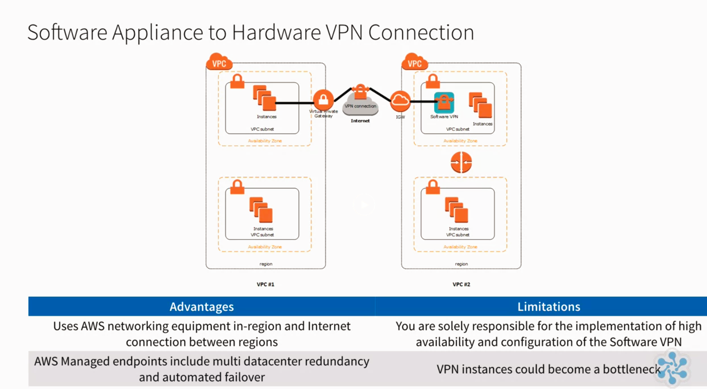
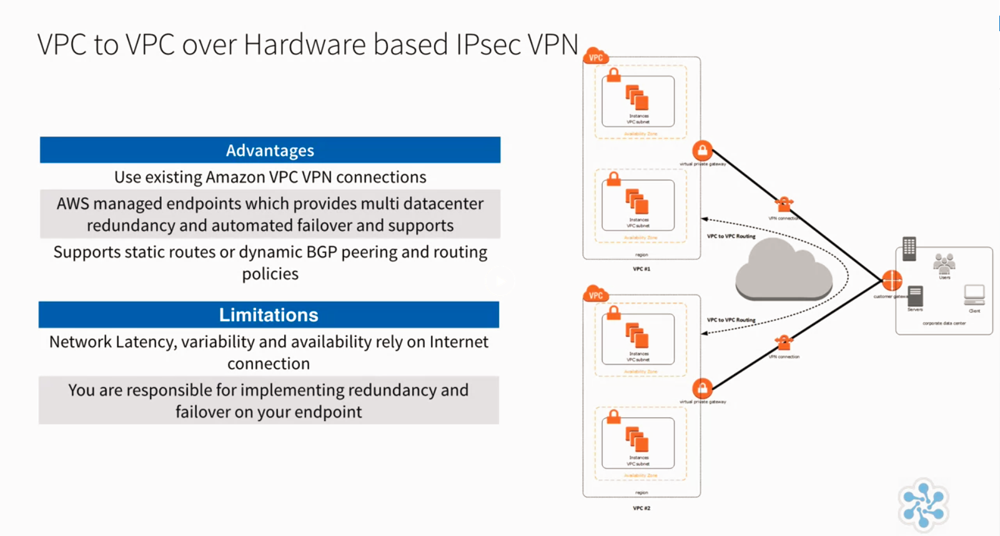
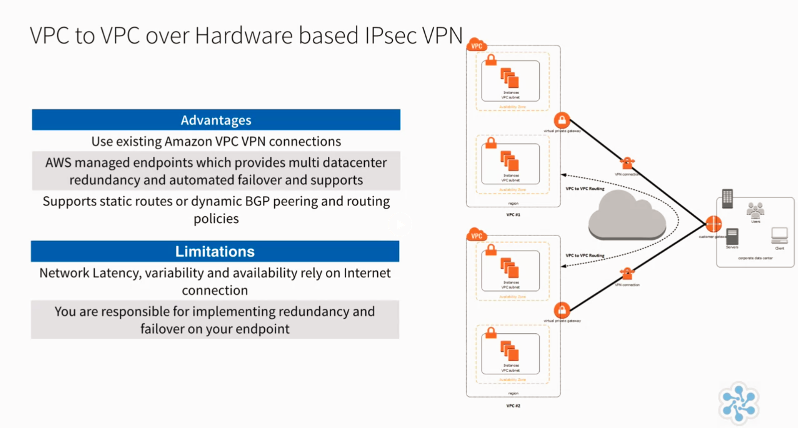

# Working with AWS Networking and Amazon VPC

## Overview

### Building Blocks
* IGW
* RT
* Router
* Subnet
* Customer GW
* VPN Connection
* VPC Peering
* VPG

### Benefits
1. Variety of connection options
2. Custom subnet IP addressing schema
3. Advanced security
4. Single tenant hardware
5. Scalable and Reliable

### Default VPC (after march 2013)
* Logically isolated virtual network in AWS Cloud
* IGW configured
* Default Subnet in each AZ
* Default SG
* EC2 receive public IP address

### Comparison EC2-Classic - Default VPC - Custom VPC

### VPC consider AWS services you need to connect to
* Assign an IP: EC2, RDS & Redshift
* Accessible via internet like S3

### Pricing
* No additional charges
* VPN connections 0,05 hour
* VPN data transfer
* EC2 in different AZs 0.01 per GB

### VPC Peering
* Connect two or more VPC in the same Region using a private Ip Address
* Same or different AWS account
* Is neither a gateway or a VPN
* Up to 50 VPC in the same Region

## VPN Connectivity

### Corporate or Home network to VPC
* Hardware based IpSec VPN over internet
  
* Dedicated network connection over private line. AWS Direct Connect
* Software appliance-based VPN over internet
  
* VPN CloudHub
   

### VPC to VPC
* VPC Peering
  
* Software Appliance-based VPC
  
* Software Appliance to Hardware VPN Connection
  
* VPC to VPC over Hardware base IpSec VPN
  
* VPC to VPC over Direct Connect & Private Lines
  
* End Users
  * Software Remote VPN Connections
  * Like checkpoint, over VPN, MS, etc.
  
## Architectural Essentials

### Start with the Key Business and Technical Requirements
* Like any architectural discussion
* Security and Audit
* Application Isolation
* Environments
* Business Alignment
* Tenancy Requirements

### VPC Design Questions
* Single VPC
  - Pro: Simple Deploy, Cost Control
  - Cons:
    - Low isolation
	- Security and Audit- No Role Separation
	- [Blast Radius](https://forums.juniper.net/t5/Data-Center-Technologists/How-Big-is-the-Blast-Radius-in-Your-Data-Center/ba-p/229119)
* Hundreds of VPCs
  - Pro: Strong Isolation, Role Separation
  - Cons:
    - Management Complexity
	- Networking Complexity
	- AWS Limits
 
* Single VPC per Region is like a traditional Data Center
* Hundreds of VPCs is equivalent of having dedicated DC per Application Role
* Find a balance considering
  - Role Separation
  - Cost Control
  - AWS Limits
  - Application Isolation
  - Management and Complexity
* IP Address
  - CIDR 192.168.1.0/24 => 32-24 =  8 bits -> -2 =    254 IP's
  - CIDR    10.0.0.1/12 => 32-16 = 16 bits -> -2 = 65.534 IP's
  - Consider expansion of AWS Regions
  - Subnets can't span AZs (more AZs)
  - Future connectivity requirements (VPN to Direct Connect)
  - **Avoid overlaping IP address spaces**
* Security and Access Control
  - Best practices: multiple layers of defense
  - Networking Segmentation --> VPC/SG/ACLs
  - Security Zoning:
    - Authorization and access control
	- Audit Logging
	- Data Classification
	- Management Infrastructure
* Best Practices for Networking Security
1. Use a layered security model
2. Always use SGs
3. Supplement SG with network ACLs
4. Use IAM and ensure separation of duities for SG and ACLs
5. Use Direct Connector IpSec
6. Protection of data in transit

## Build You VPC
### Common Scenarios (wizard for each one)
* VPC with single Public Subnet
* VPC with Public and Private Subnet
* VPC with Public and Private Subnet and Hardware VPN Access
* VPC with Private Subnet only and Hardware VPN Access
### Miscs
* Tenancy here overrides instances options
* Subnet associate with 1 AZ
* RT is implicit Router
* A Subnet must have one RT, default is VPC default RT (main RT)
* Subnet is 1 to many RT
* Best practice NOT modify main RT
* 1:1 relationship VPC:IGW
* RT of Subnet must access IGW to be a Public Subnet
* DNS Resolution
* Integration to AD (MS)
  - Enable AD Integrated Zones
  - Deploy DC in private subnet (Direct Connect)
  - Secure Dynamics DNS Updates
  - Configure DHCP options sets on VPC
* Broadcast and multi-cast are not supported
### DB Subnet Group
* Collection of subnets to use from RDS
### Classic Link. For EC2-Classic connect to VPC
* To a single VPC
* unlink when stop
* No different region nor different AWS account
* Conflict to 10.0.0.0/8
* Not allowed with VPC EIP
* No support for Dedicated Tenancy
* No support for Transitive Relationship

## Configure Your Custom VPC Security

	
	
	
	
  
