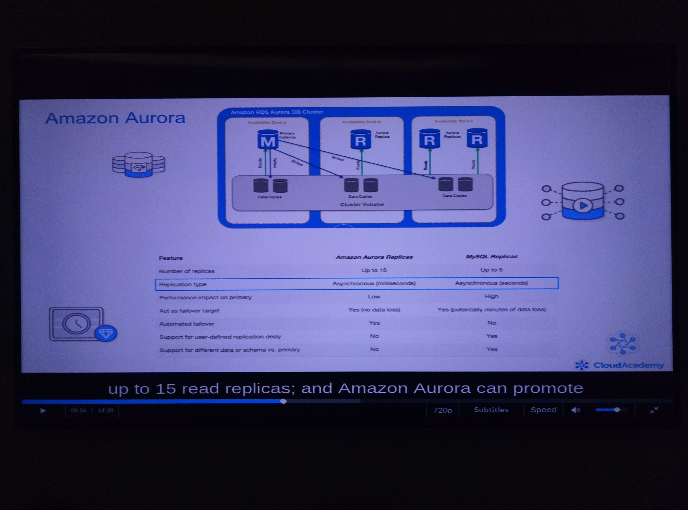

# Implementation and Deployment for Solutions Architect Associate on AWS
[Cloud Academy](https://cloudacademy.com/amazon-web-services/implementation-and-deployment-for-solutions-architect-associate-on-aws-course/)

## Solution Design
- "ACME Sample Widgets" example
- Top Ten HA
1. Must have AZ
2. Could Have CloudFront
3. Should Have Single Region
4. Route 53 for DNS & Static site page as a last "fall-back" option
5. ELB - EC2 AutoScaling - EIP
6. RDS MultiAZ. With Asynch replication with 2 failover DDBB
7. CloudWatch alarms & monitoring. Detailed monitoring installed agent.
8. Add Script to bootstrap
- We use 9 of ten HA (All except SQS) plus CloudFront

## Implementation
1. User S3_user
2. Role full permission on S3 & CloudWatch
3. RDS MySql Multi AZ
4. $ aws s3 sync. s3://wp-aws (word press files)
5. SG web server + ELB + DDBB
6. EC2 user data bootstrap
7. ELB on 3 AZ of the VPC-SG-ELB
8. CloudFront

## Optimizing for HA
* First stage
  - All except? SQS, CloudWatch, AutoScaling
  - Not meet burst demand
1. Create AutoScaling Group
   - All subnets
   - Increase & Decrease
   - Desire number of instances
2. Change MySql for Aurora
   - Comparison MySql vs Aurora
   - 
   - Migrate from MySql snapshot to Aurora
   

